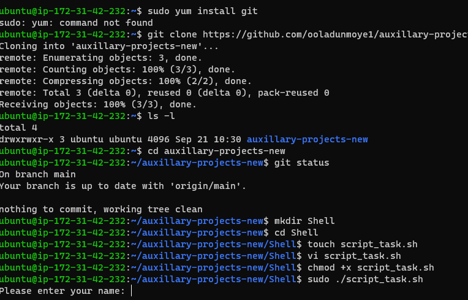
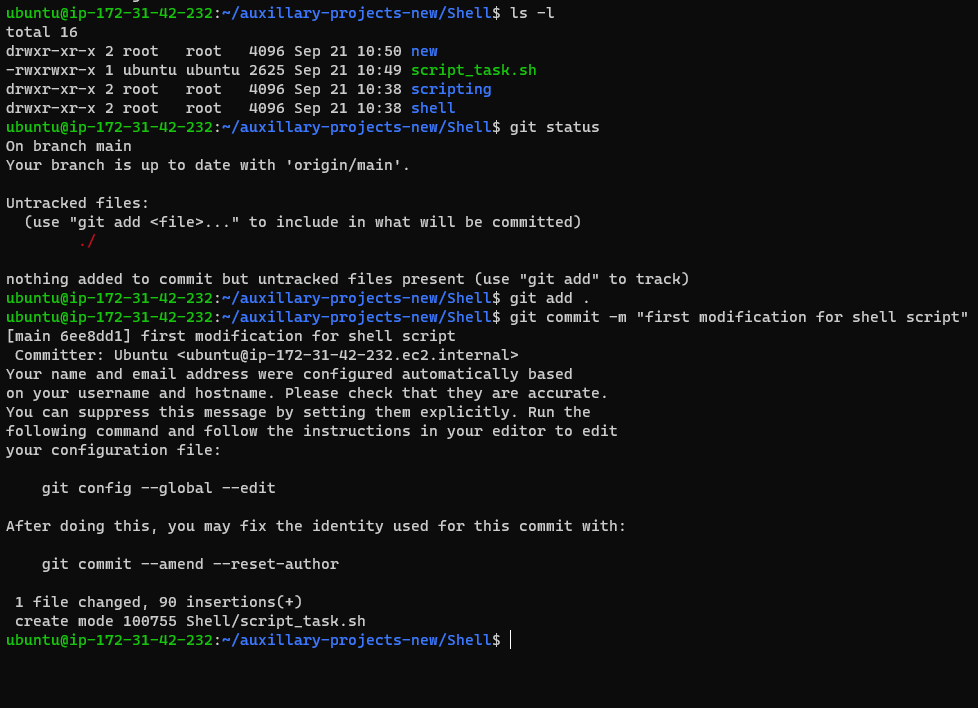
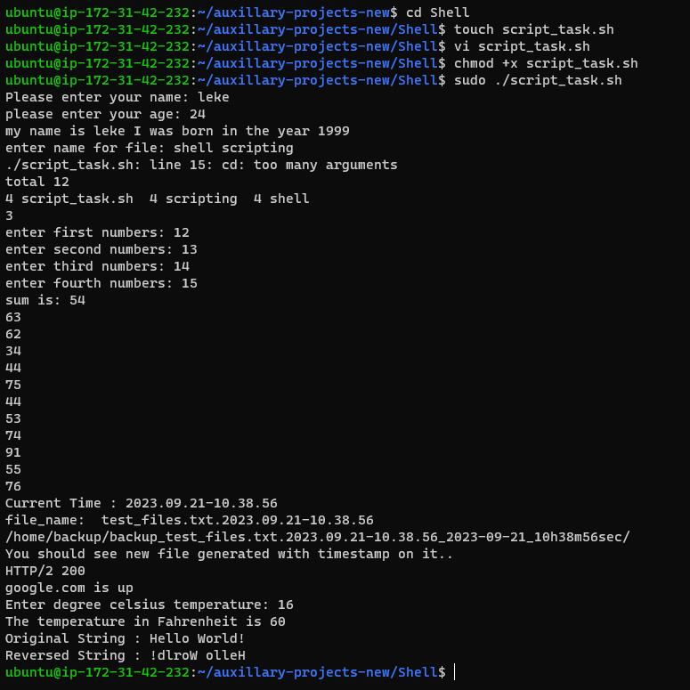
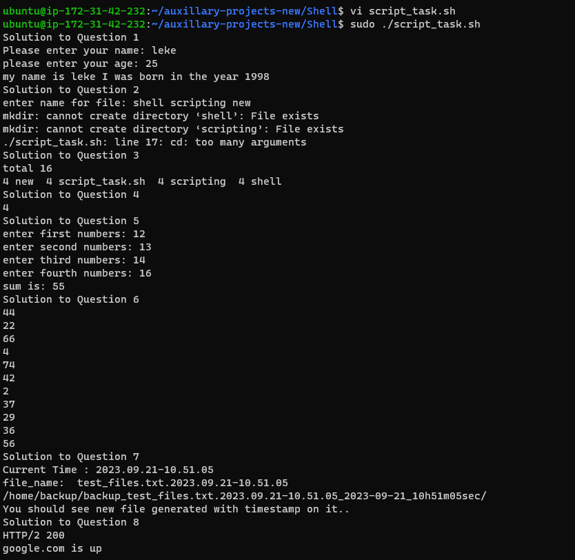
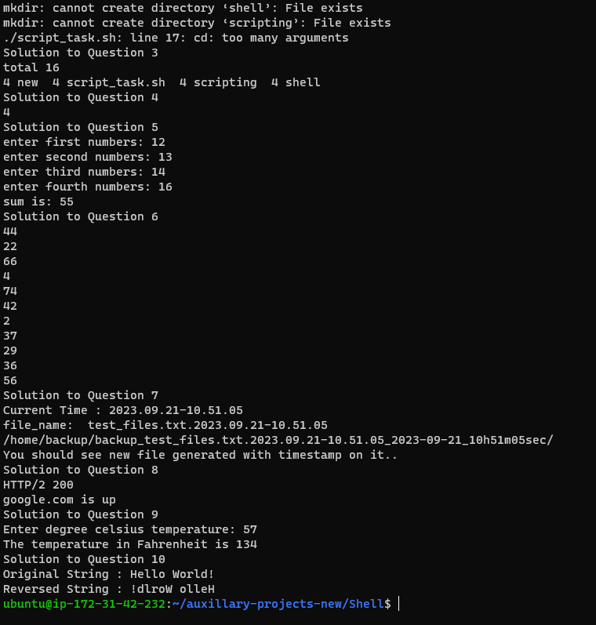

# Documentation of Shell Script Project

## *List of Items to execute for the shell script*

1.	Ask the user for their name and age, and output a message with their name and the year they were born.
2.	Create a new directory with a name provided by the user, and navigate into it.
3.	List all files in the current directory, sorted by file size.
4.	Count the number of files in the current directory and output the result.
5.	Take a list of numbers as input from the user and output the sum of those numbers.
6.	Output a random number between 1 and 100.
7.	Create a backup of a specified file by copying it to a backup directory with a timestamp in the filename.
8.	Check if a website is online and output a message indicating whether it is up or down.
9.	Convert a temperature in Celsius to Fahrenheit, using input from the user.
10.	Ask the user for a sentence, then output the sentence in reverse order. For example, if the user enters “Hello, world!”, the script should output “!dlrow ,olleH”.

## Shell folder create using below command

`mkdir Shell`

## Change directory or move to Shell folder

`cd Shell`

## Script create inside the Shell script named “script_task.sh”

`touch script_task.sh`

## Shell script write into the *”script_task.sh” file using vim editor.

`vi script_task.sh`

## findSee below  auxillary project shell script implementation screen shots

`Implementation of command to create shell script folder and touch script_task.sh `

`**Demonstration of the script**`

`*Modification of the script*`

### Thank You